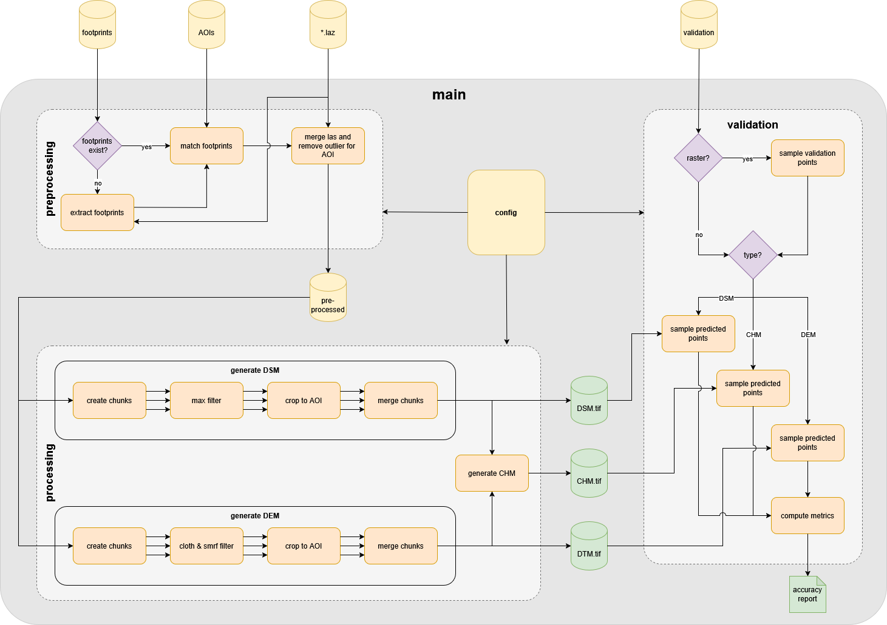

# **LidarProcessing**  
A pipeline to process LiDAR point clouds from aerial campaigns into **Digital Elevation Models (DEMs)**. Currently DSM, DTM and CHM generation are supported.


## **Project Structure**  
The code is structured around three main steps in the pipeline:  

1. **Preprocessing** (`preprocessing.py`) – Assigns point clouds to target areas and filters outliers.  
2. **Processing** (`processing.py`) – Converts preprocessed point clouds into **DSM, DEM, and CHM** outputs.  
3. **Validation** (`validation.py`) – Evaluates generated models (currently under development).  

These steps are orchestrated by `main.py` and rely on helper methods in the `/core` directory.  
Configuration settings are stored in `/config/` and are initialized in `main.py`.

## **Folder Structure**

```
project_root/
├── 01_target_areas/           # Vector footprints of target AOIs (e.g. shapefiles or GeoJSON)
├── 02_pointclouds/            # Raw LiDAR point clouds (*.las or *.laz)
├── 03_las_footprints/         # Flight path footprints (generated if missing)
├── 04_preprocessed/           # Cleaned point clouds after outlier removal
├── 05_results/                # Output rasters from processing
│   └── <run_name>/            
│       ├── DSM/               # Digital Surface Models
│       ├── DTM/               # Digital Terrain Models
│       └── CHM/               # Canopy Height Models (DSM - DTM)
├── 06_validation/             # External raster or vector data used for validation
```

## **Pipeline Overview**  
### **1. Preprocessing**  
- Assigns LiDAR point clouds to user-defined target areas (e.g., aerial image footprints or AOIs).  
- Target areas should be stored as individual files but can be converted if necessary.  
- Outliers are removed using **statistical outlier removal** techniques.  

### **2. Processing**  
- Converts the preprocessed point clouds into:  
  - **Digital Surface Models (DSM)**  
  - **Digital Elevation Models (DEM)**  
  - **Canopy Height Models (CHM)**  
- Outputs are saved as **GeoTIFFs**.  

### **3. Validation** 
- Evaluates the generated models.  
- Compares against:  
  - **Single points** or **entire raster datasets**.  
  - User-defined pixel subsets or complete rasters.  
- Evaluates ground, surface, and vegetation height.  



For efficiency, point clouds are split into **smaller chunks** and processed in **parallel**.  

## **Setup**  
The pipeline requires **Python 3.8+** and the following dependencies:  
```bash
pip install pdal laspy shapely geopandas rasterio numpy scipy tqdm
```
or using Conda:  
```bash
conda install -c conda-forge pdal laspy shapely geopandas rasterio numpy scipy tqdm
```
But the easiest way is to use the `example_env.yml`.

## **Usage**  
### **1. Configure Settings**  
Before running the pipeline, update the paths and parameters in `config.py`.  
You can create **separate config files** for different datasets or use cases and select them in `main.py`. 

### **2. Run the Pipeline**  
To process LiDAR data from start to finish, simply run:  
```bash
python main.py
```
This executes all pipeline steps: **Preprocessing → Processing → Validation**.

### **3. Running Individual Steps**  
To run specific steps:  
- Convert `main.py` into a **Jupyter Notebook**.  
- Or manually **comment out** the steps you don’t need.  

## **Coming Soon **  
**GPU Acceleration** for faster processing.  
**HPC (High-Performance Computing) Support** for large-scale datasets.  
